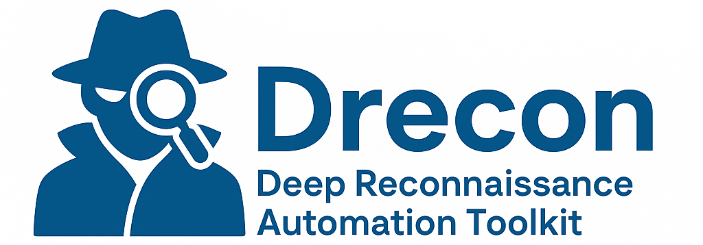

# 🕵️‍♂️ Drecon — Deep Reconnaissance Automation Toolkit

<p align="center">
  
</p>


> **Drecon** (Deep Recon) is a fully automated reconnaissance pipeline for bug bounty hunters, red teamers, and cyber threat researchers. It aggregates subdomains, probes for services, scans for vulnerabilities, and gathers OSINT data — all with minimal user interaction.

---

## 🚀 Key Features

- 🔍 Fast and multi-source **subdomain enumeration**
- 🌐 DNS resolving and **live host detection**
- 🚪 **Port scanning** and service identification
- 🛡️ **Vulnerability scanning** using Nuclei & Subzy
- 🕸️ **Archived URL discovery** and **crawling**
- 📜 Clean reporting and logging structure

---

## 🧰 Tools Used

| Phase              | Tools                                                                 |
|--------------------|-----------------------------------------------------------------------|
| Subdomain Enum     | `subfinder`, `assetfinder`, `github-subdomains`, `chaos`, `crt.sh`   |
| DNS & Probing      | `dnsx`, `naabu`, `httpx`, `shodan`                                    |
| Vulnerability Scan | `nuclei`, `subzy`                                                     |
| URL Collection     | `gau`, `waybackurls`                                                  |
| Crawling & Extras  | `katana`, `curl`, `jq`, `whois`, `unzip`                              |

---

## 📦 Installation

1. **Clone the repo**

```bash
git clone https://github.com/yourusername/drecon.git
cd drecon
```

2. **Install all dependencies**

```bash
chmod +x install_tools.sh
./install_tools.sh
```

3. **Usage**

```bash
./drecon.sh target.com

#Expected output:
[+] Starting reconnaissance for: target.com
[+] Total unique subdomains: 238
[+] Output saved to: results/target.com.txt
[+] Running Phase 2...
[+] Scan log saved to: logs/target.com.log
```

## 🎯 Pro Tips
- 🗝️ Use your own API keys for Chaos, Shodan, GitHub, and Nuclei to unlock full capabilities.
- 🔐 Use a VPN or VPS for anonymity and large-scale scans.
- 🧩 Modular: Comment out tools you don’t want to run.

## 📄 License
MIT — feel free to use, modify, and share. Attribution appreciated.

## ⭐ Support
If you find Drecon helpful, please consider starring 🌟 this repository — it helps a lot!
